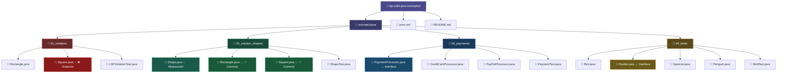

# Estudiantes
## Allan Caicedo
## Juan gaviria

```mermaid
graph TD
    ROOT["📁 lsp-solid-java-examples/"]
    SRC["📁 src/main/java/"]
 
    ROOT --> SRC
    ROOT --> POM["📄 pom.xml"]
    ROOT --> README["📄 README.md"]
 
    SRC --> V["📁 01_violation/"]
    SRC --> S["📁 02_solution_shapes/"]
    SRC --> P["📁 03_payments/"]
    SRC --> B["📁 04_birds/"]
 
    %% 01_violation
    V --> V1["📄 Rectangle.java"]
    V --> V2["📄 Square.java ← ❌ Violación"]
    V --> V3["📄 LSPViolationTest.java"]
 
    %% 02_solution_shapes
    S --> S1["📄 Shape.java ← Abstracción"]
    S --> S2["📄 Rectangle.java ← ✅ Correcto"]
    S --> S3["📄 Square.java ← ✅ Correcto"]
    S --> S4["📄 ShapeTest.java"]
 
    %% 03_payments
    P --> P1["📄 PaymentProcessor.java ← Interface"]
    P --> P2["📄 CreditCardProcessor.java"]
    P --> P3["📄 PayPalProcessor.java"]
    P --> P4["📄 PaymentTest.java"]
 
    %% 04_birds
    B --> B1["📄 Bird.java"]
    B --> B2["📄 Flyable.java ← Interface"]
    B --> B3["📄 Sparrow.java"]
    B --> B4["📄 Penguin.java"]
    B --> B5["📄 BirdTest.java"]
 
    %% Estilos
    style ROOT fill:#4a4a8a,stroke:#7070cc,color:#fff
    style SRC  fill:#3a3a6a,stroke:#6060aa,color:#fff
 
    style V  fill:#6a2a2a,stroke:#cc4444,color:#fff
    style V2 fill:#8a1a1a,stroke:#cc2222,color:#fff
 
    style S  fill:#1a4a3a,stroke:#33aa77,color:#fff
    style S1 fill:#1a5a4a,stroke:#33bb88,color:#fff
    style S2 fill:#1a5a3a,stroke:#33aa66,color:#fff
    style S3 fill:#1a5a3a,stroke:#33aa66,color:#fff
 
    style P  fill:#1a3a5a,stroke:#3366cc,color:#fff
    style P1 fill:#1a4a6a,stroke:#3377dd,color:#fff
 
    style B  fill:#5a4a1a,stroke:#cc9933,color:#fff
    style B2 fill:#6a5a1a,stroke:#ddaa33,color:#fff
```